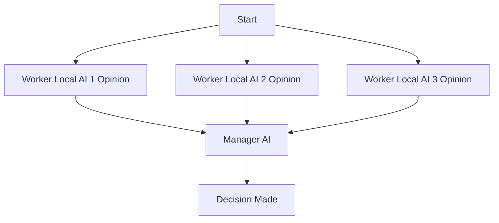

# Multi-Model Advisor
## (锵锵四人行)

[](https://smithery.ai/server/@YuChenSSR/multi-ai-advisor-mcp)

A Model Context Protocol (MCP) server that queries multiple Ollama models and combines their responses, providing diverse AI perspectives on a single question. This creates a "council of advisors" approach where Claude can synthesize multiple viewpoints alongside its own to provide more comprehensive answers.

<a href="https://glama.ai/mcp/servers/@YuChenSSR/multi-ai-advisor-mcp">
  
</a>



## Features

- Query multiple Ollama models with a single question
- Assign different roles/personas to each model
- View all available Ollama models on your system
- Customize system prompts for each model
- Configure via environment variables
- Integrate seamlessly with Claude for Desktop

## Prerequisites

- Node.js 16.x or higher
- Ollama installed and running (see [Ollama installation](https://github.com/ollama/ollama#installation))
- Claude for Desktop (for the complete advisory experience)

## Installation

### Installing via Smithery

To install multi-ai-advisor-mcp for Claude Desktop automatically via [Smithery](https://smithery.ai/server/@YuChenSSR/multi-ai-advisor-mcp):

```bash
npx -y @smithery/cli install @YuChenSSR/multi-ai-advisor-mcp --client claude
```

### Manual Installation
1. Clone this repository:
   ```bash
   git clone https://github.com/YuChenSSR/multi-ai-advisor-mcp.git 
   cd multi-ai-advisor-mcp
   ```

2. Install dependencies:
   ```bash
   npm install
   ```

3. Build the project:
   ```bash
   npm run build
   ```

4. Install required Ollama models:
   ```bash
   ollama pull gemma3:1b
   ollama pull llama3.2:1b
   ollama pull deepseek-r1:1.5b
   ```

## Configuration

### Via Environment Variables

Create a `.env` file in the project root with your desired configuration:

```
# Server configuration
SERVER_NAME=multi-model-advisor
SERVER_VERSION=1.0.0
DEBUG=true

# Ollama configuration
OLLAMA_API_URL=http://localhost:11434
DEFAULT_MODELS=gemma3:1b,llama3.2:1b,deepseek-r1:1.5b

# System prompts for each model
GEMMA_SYSTEM_PROMPT=You are a creative and innovative AI assistant. Think outside the box and offer novel perspectives.
LLAMA_SYSTEM_PROMPT=You are a supportive and empathetic AI assistant focused on human well-being. Provide considerate and balanced advice.
DEEPSEEK_SYSTEM_PROMPT=You are a logical and analytical AI assistant. Think step-by-step and explain your reasoning clearly.
```

### Via Command-Line Arguments

You can also override settings by passing command-line arguments when starting the server. CLI arguments take precedence over environment variables:

```bash
node build/index.js [OPTIONS]
```

**Available Options:**
- `--server-name NAME` - Server name (default: multi-model-advisor)
- `--server-version VERSION` - Server version (default: 1.0.0)
- `--debug` - Enable debug mode (flag, no value needed)
- `--ollama-url URL` - Ollama API URL (default: http://localhost:11434)
- `--models MODEL1,MODEL2,...` - Comma-separated list of models
- `--model1-prompt "TEXT"` - System prompt for 1st model (works with ANY models!)
- `--model2-prompt "TEXT"` - System prompt for 2nd model
- `--model3-prompt "TEXT"` - System prompt for 3rd model (etc.)

**Examples:**

```bash
# Start with defaults from .env
npm start

# Enable debug mode
npm run start:debug
# or: node build/index.js --debug

# Use a remote Ollama instance
node build/index.js --ollama-url http://192.168.1.100:11434

# Any models with dynamic prompts
node build/index.js \
  --models llama3:latest,neural-chat,mistral \
  --model1-prompt "You are funny" \
  --model2-prompt "You are helpful" \
  --model3-prompt "You are analytical"

# Combine CLI args with environment variables
OLLAMA_API_URL=http://remote:11434 node build/index.js --debug --models llama3:latest
```

**Predefined npm scripts:**
- `npm start` - Start with default configuration
- `npm run start:debug` - Start with debug mode enabled
- `npm run build` - Compile TypeScript to JavaScript

## Connect to Claude for Desktop

1. Locate your Claude for Desktop configuration file:
   - MacOS: `~/Library/Application Support/Claude/claude_desktop_config.json`
   - Windows: `%APPDATA%\Claude\claude_desktop_config.json`

2. Edit the file to add the Multi-Model Advisor MCP server:

```json
{
  "mcpServers": {
    "multi-model-advisor": {
      "command": "node",
      "args": ["/absolute/path/to/multi-ai-advisor-mcp/build/index.js"]
    }
  }
}
```

3. Replace `/absolute/path/to/` with the actual path to your project directory

4. Restart Claude for Desktop

## Usage

Once connected to Claude for Desktop, you can use the Multi-Model Advisor in several ways:

### List Available Models

You can see all available models on your system:

```
Show me which Ollama models are available on my system
```

This will display all installed Ollama models and indicate which ones are configured as defaults.

### Basic Usage

Simply ask Claude to use the multi-model advisor:

```
what are the most important skills for success in today's job market, 
```

Claude will query all default models and provide a synthesized response based on their different perspectives.


## How It Works

1. The MCP server exposes two tools:
   - `list-available-models`: Shows all Ollama models on your system
   - `query-models`: Queries multiple models with a question

2. When you ask Claude a question referring to the multi-model advisor:
   - Claude decides to use the `query-models` tool
   - The server sends your question to multiple Ollama models
   - Each model responds with its perspective
   - Claude receives all responses and synthesizes a comprehensive answer

3. Each model can have a different "persona" or role assigned, encouraging diverse perspectives.

## Troubleshooting

### Ollama Connection Issues

If the server can't connect to Ollama:
- Ensure Ollama is running (`ollama serve`)
- Check that the OLLAMA_API_URL is correct in your .env file
- Try accessing http://localhost:11434 in your browser to verify Ollama is responding

### Model Not Found

If a model is reported as unavailable:
- Check that you've pulled the model using `ollama pull <model-name>`
- Verify the exact model name using `ollama list`
- Use the `list-available-models` tool to see all available models

### Claude Not Showing MCP Tools

If the tools don't appear in Claude:
- Ensure you've restarted Claude after updating the configuration
- Check the absolute path in claude_desktop_config.json is correct
- Look at Claude's logs for error messages

### RAM is not enough

Some managers' AI models may have chosen larger models, but there is not enough memory to run them. You can try specifying a smaller model (see the [Basic Usage](#basic-usage)) or upgrading the memory.

## License

MIT License

For more details, please see the LICENSE file in [this project repository](https://github.com/YuChenSSR/multi-ai-advisor-mcp)

## Contributing

Contributions are welcome! Please feel free to submit a Pull Request.