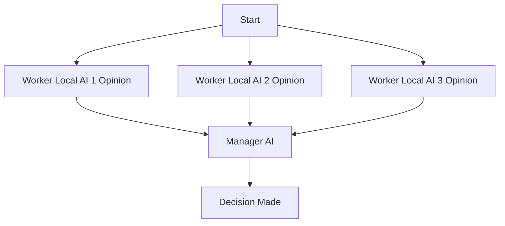

# Multi-Model Advisor
## (锵锵四人行)

[](https://smithery.ai/server/@YuChenSSR/multi-ai-advisor-mcp)

A Model Context Protocol (MCP) server that queries Ollama models and provides AI-powered responses. By default, it uses a single advisor model (deepseek-r1:1.5b) for efficient thinking and reasoning. You can optionally configure multiple models to create a "council of advisors" approach where Claude can synthesize multiple viewpoints alongside its own to provide more comprehensive answers.

<a href="https://glama.ai/mcp/servers/@YuChenSSR/multi-ai-advisor-mcp">
  
</a>



## Features

- **Single Advisor Mode (Default)**: Fast and efficient with one thinking model
- **Multi-Advisor Mode (Optional)**: Query multiple Ollama models for diverse perspectives
- **Smart Template System**: Auto-detects and uses optimal prompt format for each model
  - Llama3, Command-R, ChatML, Mistral, Qwen support
  - Legacy text-based format for compatibility
  - Manual override options available
- Assign different roles/personas to each model
- View all available Ollama models on your system
- Customize system prompts for each model
- Configure via environment variables or CLI arguments
- Integrate seamlessly with Claude for Desktop
- Sync and async query modes for flexible workflow

## Prerequisites

- Node.js 16.x or higher
- Ollama installed and running (see [Ollama installation](https://github.com/ollama/ollama#installation))
- Claude for Desktop (for the complete advisory experience)

## Installation

### Installing via Smithery

To install multi-ai-advisor-mcp for Claude Desktop automatically via [Smithery](https://smithery.ai/server/@YuChenSSR/multi-ai-advisor-mcp):

```bash
npx -y @smithery/cli install @YuChenSSR/multi-ai-advisor-mcp --client claude
```

### Manual Installation
1. Clone this repository:
   ```bash
   git clone https://github.com/YuChenSSR/multi-ai-advisor-mcp.git 
   cd multi-ai-advisor-mcp
   ```

2. Install dependencies:
   ```bash
   npm install
   ```

3. Build the project:
   ```bash
   npm run build
   ```

4. Install required Ollama model:
   ```bash
   ollama pull deepseek-r1:1.5b
   ```

   Optional: Install additional models for multi-advisor setup:
   ```bash
   ollama pull gemma3:1b
   ollama pull llama3.2:1b
   ```

## Configuration

### Via Environment Variables

Create a `.env` file in the project root with your desired configuration:

```
# Server configuration
SERVER_NAME=multi-model-advisor
SERVER_VERSION=1.0.0
DEBUG=true

# Ollama configuration
OLLAMA_API_URL=http://localhost:11434
DEFAULT_MODELS=deepseek-r1:1.5b

# For multiple advisors (optional):
# DEFAULT_MODELS=gemma3:1b,llama3.2:1b,deepseek-r1:1.5b

# System prompts for each model
GEMMA_SYSTEM_PROMPT=You are a creative and innovative AI assistant. Think outside the box and offer novel perspectives.
LLAMA_SYSTEM_PROMPT=You are a supportive and empathetic AI assistant focused on human well-being. Provide considerate and balanced advice.
DEEPSEEK_SYSTEM_PROMPT=You are a logical and analytical AI assistant. Think step-by-step and explain your reasoning clearly.
```

### Via Command-Line Arguments

You can also override settings by passing command-line arguments when starting the server. CLI arguments take precedence over environment variables:

```bash
node build/index.js [OPTIONS]
```

**Available Options:**
- `--server-name NAME` - Server name (default: multi-model-advisor)
- `--server-version VERSION` - Server version (default: 1.0.0)
- `--debug` - Enable debug mode (flag, no value needed)
- `--ollama-url URL` - Ollama API URL (default: http://localhost:11434)
- `--models MODEL1,MODEL2,...` - Comma-separated list of models
- `--model1-prompt "TEXT"` - System prompt for 1st model (works with ANY models!)
- `--model2-prompt "TEXT"` - System prompt for 2nd model
- `--model3-prompt "TEXT"` - System prompt for 3rd model (etc.)

**Examples:**

```bash
# Start with defaults from .env
npm start

# Enable debug mode
npm run start:debug
# or: node build/index.js --debug

# Use a remote Ollama instance
node build/index.js --ollama-url http://192.168.1.100:11434

# Use a single advisor (default)
node build/index.js --models deepseek-r1:1.5b

# Use multiple models with dynamic prompts
node build/index.js \
  --models llama3:latest,neural-chat,mistral \
  --model1-prompt "You are funny" \
  --model2-prompt "You are helpful" \
  --model3-prompt "You are analytical"

# Combine CLI args with environment variables
OLLAMA_API_URL=http://remote:11434 node build/index.js --debug
```

**Predefined npm scripts:**
- `npm start` - Start with default configuration
- `npm run start:debug` - Start with debug mode enabled
- `npm run build` - Compile TypeScript to JavaScript

## Connection Modes

Multi-Model Advisor supports two connection modes:

### 1. stdio Mode (Default) - For Claude Desktop

The traditional stdio mode spawns a new process for each client connection. Best for Claude Desktop integration.

1. Locate your Claude for Desktop configuration file:
   - MacOS: `~/Library/Application Support/Claude/claude_desktop_config.json`
   - Windows: `%APPDATA%\Claude\claude_desktop_config.json`

2. Edit the file to add the Multi-Model Advisor MCP server:

```json
{
  "mcpServers": {
    "multi-model-advisor": {
      "command": "node",
      "args": ["/absolute/path/to/multi-ai-advisor-mcp/build/index.js"]
    }
  }
}
```

3. Replace `/absolute/path/to/` with the actual path to your project directory

4. Restart Claude for Desktop

### 2. SSE Mode (Persistent Server) - For Programmatic Access

SSE (Server-Sent Events) mode runs a persistent server that multiple clients can connect to via HTTP. Best for API integrations, custom clients, and development.

**Start the server:**

```bash
# Using environment variable
MCP_TRANSPORT=sse node build/index.js

# Or using CLI argument
node build/index.js --mcp-transport sse
```

**Connect a client:**

```bash
# Run the example client
node build/examples/sse-client.js
```

**Monitor sessions:**

```bash
# View active MCP sessions
curl http://localhost:3001/mcp/sessions
```

**Configuration options:**

```bash
# In .env file
MCP_TRANSPORT=sse                    # Enable SSE mode
MCP_SESSION_TIMEOUT_MINUTES=60       # Session timeout (default: 60)
WEB_UI_PORT=3001                     # Server port (default: 3001)

# Or via CLI
node build/index.js \
  --mcp-transport sse \
  --mcp-session-timeout 60 \
  --web-ui-port 3001
```

**Advantages of SSE mode:**
- ✅ Persistent server (no restart per client)
- ✅ Multiple clients can connect simultaneously
- ✅ Shared database and job queue across clients
- ✅ HTTP endpoint for easy discovery
- ✅ Session monitoring via `/mcp/sessions`
- ✅ Better for API integrations

See [examples/README.md](examples/README.md) for detailed SSE client examples.

### 3. Gemini CLI Mode - For Google Gemini Integration

**NEW!** Google Gemini CLI now supports MCP with SSE transport. You can use this MCP server with Gemini CLI!

**Setup:**

1. Install Gemini CLI:
   ```bash
   npm install -g @google-labs/gemini-cli
   ```

2. Start MCP server in SSE mode:
   ```bash
   node build/index.js --mcp-transport sse
   ```

3. Configure Gemini CLI (`~/.gemini/settings.json`):
   ```json
   {
     "mcpServers": {
       "multi-model-advisor": {
         "url": "http://localhost:3001/mcp/sse",
         "timeout": 60000,
         "trust": true
       }
     }
   }
   ```

4. Use with Gemini CLI:
   ```bash
   gemini chat
   # In chat: "Use query-models to ask local AI models about [your question]"
   ```

**Benefits:** Combine Gemini's cloud intelligence with your local privacy-focused models!

See [GEMINI_CLI.md](GEMINI_CLI.md) for complete Gemini CLI integration guide.

## Usage

Once connected to Claude Desktop or Gemini CLI, you can use the Multi-Model Advisor in several ways:

### List Available Models

You can see all available models on your system:

```
Show me which Ollama models are available on my system
```

This will display all installed Ollama models and indicate which ones are configured as defaults.

### Basic Usage

Simply ask Claude to use the advisor:

```
what are the most important skills for success in today's job market,
```

By default, Claude will query the single advisor model (deepseek-r1:1.5b) for fast and efficient reasoning. If you have configured multiple models, it will query all of them and provide a synthesized response based on their different perspectives.

#### Sync Mode (Default)

By default, the tool waits for the advisor model(s) to respond and returns results directly:

```
Use the advisor to analyze: "What is the future of AI?"
```

The tool will automatically wait for the model(s) to respond (up to 10 minutes) and return the results.

#### Async Mode (Manual Polling)

For non-blocking execution with manual polling, set `wait_for_completion=false`:

```
Use the advisor with wait_for_completion=false to analyze: "What is the future of AI?"
```

Claude will:
1. Submit the query and get a job ID
2. Poll the job status using `get-job-progress`
3. Retrieve results when complete using `get-job-result`


## How It Works

1. The MCP server exposes two tools:
   - `list-available-models`: Shows all Ollama models on your system
   - `query-models`: Queries multiple models with a question

2. When you ask Claude a question referring to the advisor:
   - Claude decides to use the `query-models` tool
   - The server sends your question to the configured Ollama model(s)
   - By default, one advisor model (deepseek-r1:1.5b) responds with reasoning
   - If multiple models are configured, each responds with its perspective
   - Claude receives the response(s) and synthesizes a comprehensive answer

3. When using multiple models, each can have a different "persona" or role assigned, encouraging diverse perspectives.

### Query Modes

The `query-models` tool supports two modes:

- **Sync Mode (default)**: Automatically waits for results
  - Blocks until model(s) respond
  - Returns results directly
  - Maximum wait time: 10 minutes
  - Best for interactive use

- **Async Mode**: Set `wait_for_completion: false` for manual polling
  - Returns a job ID immediately
  - Use `get-job-progress` to check status
  - Use `get-job-result` to retrieve results when complete
  - Best for long-running queries or when you need non-blocking execution

## Troubleshooting

### Ollama Connection Issues

If the server can't connect to Ollama:
- Ensure Ollama is running (`ollama serve`)
- Check that the OLLAMA_API_URL is correct in your .env file
- Try accessing http://localhost:11434 in your browser to verify Ollama is responding

### Model Not Found

If a model is reported as unavailable:
- Check that you've pulled the model using `ollama pull <model-name>`
- Verify the exact model name using `ollama list`
- Use the `list-available-models` tool to see all available models

### Claude Not Showing MCP Tools

If the tools don't appear in Claude:
- Ensure you've restarted Claude after updating the configuration
- Check the absolute path in claude_desktop_config.json is correct
- Look at Claude's logs for error messages

### RAM is not enough

Some managers' AI models may have chosen larger models, but there is not enough memory to run them. You can try specifying a smaller model (see the [Basic Usage](#basic-usage)) or upgrading the memory.

## Advanced Features

### Template System

The server supports multiple prompt template formats for better model compatibility. See [TEMPLATES.md](TEMPLATES.md) for detailed documentation on:
- Auto-detection of optimal template format (Llama3, Command-R, ChatML, etc.)
- Manual template override options
- Supported model families
- Configuration examples

### Port Configuration

The server uses separate ports for different services to avoid conflicts:

| Service | Default Port | Config Option | Environment Variable |
|---------|--------------|---------------|---------------------|
| Frontend (Next.js) | 3000 | `--frontend-port` | `FRONTEND_PORT` |
| Backend (API + MCP) | 3001 | `--backend-port` | `BACKEND_PORT` |

**Example:**
```bash
node build/index.js \
  --mcp-transport sse \
  --frontend-port 8080 \
  --backend-port 8081
```

## Troubleshooting

### Port Conflicts

If you see "EADDRINUSE" error, another process is using the port. Solutions:

1. **Use different ports:**
   ```bash
   node build/index.js --backend-port 3002
   ```

2. **Disable Web UI** (if you only need MCP):
   ```bash
   node build/index.js --web-ui false --mcp-transport sse
   ```

3. **Find and kill the process:**
   ```bash
   # Windows
   netstat -ano | findstr :3000
   taskkill /PID <PID> /F

   # Linux/Mac
   lsof -i :3000
   kill -9 <PID>
   ```

### More Help

For detailed troubleshooting, see:
- **[TROUBLESHOOTING.md](TROUBLESHOOTING.md)** - Complete troubleshooting guide
- **[GEMINI_CLI.md](GEMINI_CLI.md)** - Gemini CLI integration
- **[CLAUDE.md](CLAUDE.md)** - Developer documentation

## License

MIT License

For more details, please see the LICENSE file in [this project repository](https://github.com/YuChenSSR/multi-ai-advisor-mcp)

## Contributing

Contributions are welcome! Please feel free to submit a Pull Request.